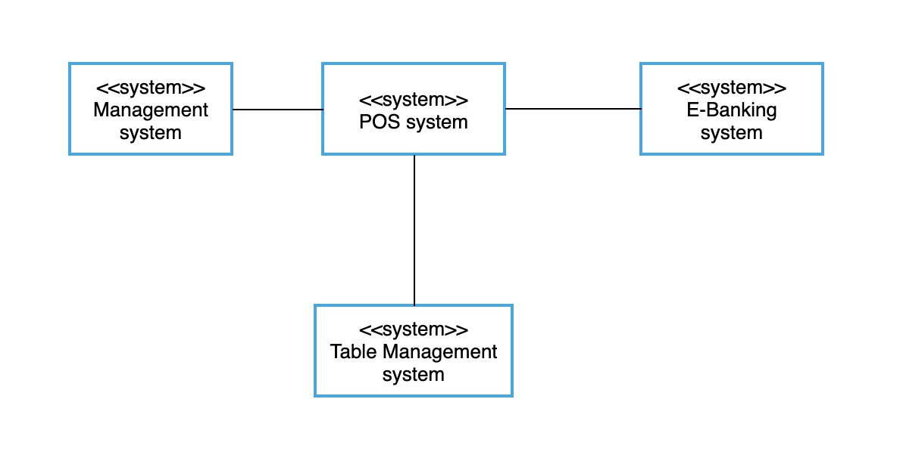

# Project Overview

## Project Scope

**Project scope description:**
This project is dedicated to developing a web-based point of sales system to match the restaurant owner's needs in these trying times, namely to allow sales of food items and meals to happen without direct contact between customers and clerks. This system may later be expanded into something commonly used by any restaurant.

 **Project objectives:**
This project aims to create an opportunity for restaurant owners to continue running their businesses under the effect of the Covid-19 pandemic. This project also aims to reduce the potential risks and costs of regular restaurant operations regardless of the pandemic and improve the general restaurant experience in both the customers and the owners/staff.

 **Project deliverable:**
This project promises to deliver a completed point of sale service with full access and authorization to the user and a detailed training document to help employees and managers quickly get used to working with the system. 

**Project acceptance criteria:**
The project will meet the acceptance criteria when it has been verified to successfully fulfill both functional and non-functional requirements based on the established user's story.

 **Project exclusions:**
This project shall not include the tools, platform or domain needed to host, maintain and operate the service along with the database server that keeps track of all the transaction records.

 **Project assumptions:**
Employees will have been trained for their respective position within the system and will follow the standard documented procedures when working with the system. All equipment/tools involved are expected not to malfunction mid-operation under any circumstances. Routine checkups and maintenance of the system should be performed regularly to detect any abnormalities. It is assumed that only online payment is allowed when using this system to ensure non-direct contact between customers and staffs.

## Context
A customer arriving at a restaurant using this POS System can scan the QR code or type in the website name to access the system. He/she then places an order through this system and pays for the meal. A clerk can checks the order and the kitchen staff receives the order via the system. The system also records all the orders and transactions for the manager to review.

## Context Model

